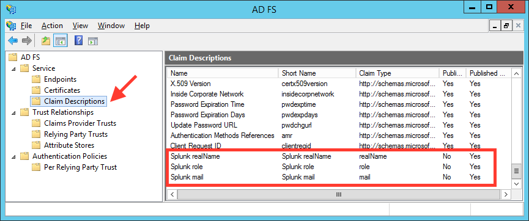
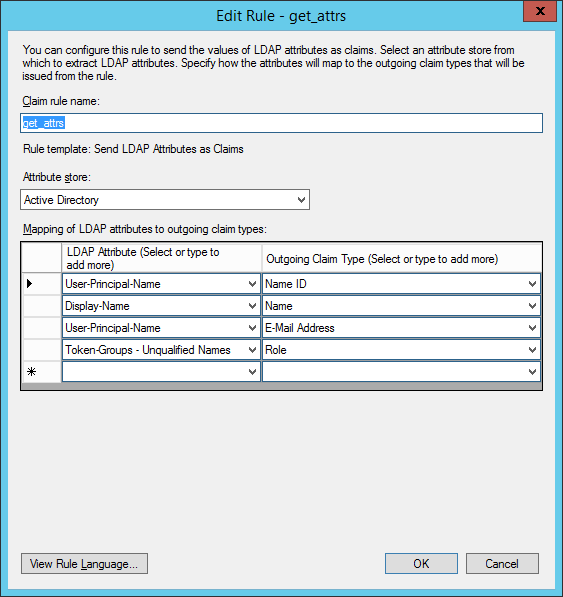
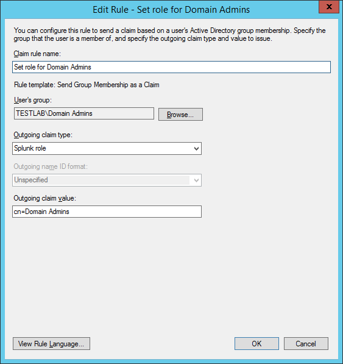
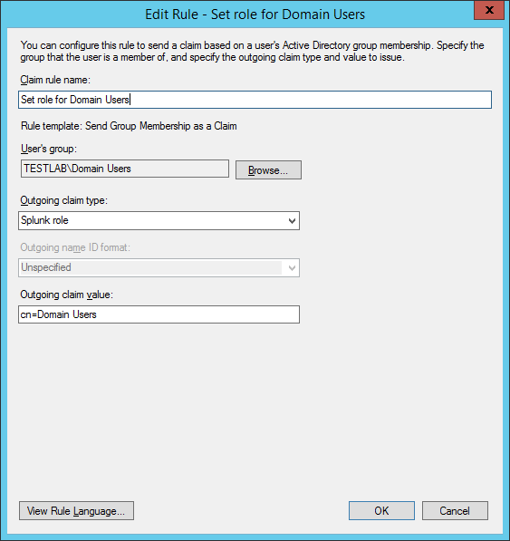
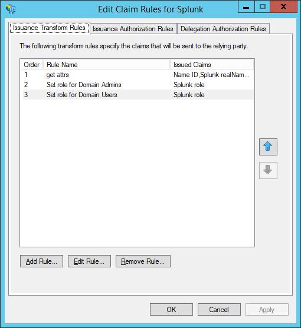

# Puppet module to deploy Splunk into any imaginable topology.

[](https://travis-ci.org/jorritfolmer/puppet-splunk)

This Puppet module can be used to create and arrange Splunk instances into simple, distributed or clustered topologies. It does so with the following principles in mind:

## Principles

1. **Splunk above Puppet.** Puppet is only used to configure the running skeleton of a Splunk constellation. It tries to keep away from Splunk administration as much as possible. For example, why deploy Splunk apps to forwarders through Puppet if you can use Splunk's multi-platform deployment server?
2. **Power to the Splunkers.** A Splunk installation should typically not be administered by the IT or IT-infra teams, since it is often used in an audit context.
3. **Secure by default**.
  - Splunk runs as user splunk instead of root.
  - No services are listening by default except the bare minimum (8089/tcp)
  - TLSv1.1 and TLSv1.2 are enabled by default
  - Perfect Forward Secrecy (PFS) using Elliptic curve Diffie-Hellman (ECDH)
  - Ciphers are set to [modern compatibility](https://wiki.mozilla.org/Security/Server_Side_TLS)
  - Admin password can be set using its SHA512 hash in the Puppet manifests instead of plain-text.
4. **Supports any topology.** Single server? Redundant multi-site clustering? Heavy forwarder in a DMZ?

## Prerequisites

1. A running Puppet master
2. A running repository server with splunk and splunkforwarder packages. See below if you need help setting it up.

### Splunk YUM repository (Red Hat based)

If you don't already have a local repository server, the quickest way is to install Apache on the Puppet master and have this serve the yum repository.

1. `yum install httpd`
2. `yum install createrepo`
3. `mkdir /var/www/html/splunk`
4. `cd /var/www/html/splunk`
5. download splunk-x.y.x.rpm
6. download splunk-forwarder-x.y.x.rpm
7. `createrepo .`
8. make sure Apache allows directory index listing
9. surf to http://your.repo.server/splunk and check if you get a directory listing

Then add something like this to every node definition in site.pp, and require it from the splunk class so it it evaluated before the splunk class.

```
yumrepo { "splunk":
  baseurl => "http://your.repo.server/splunk",
  descr => "Splunk repo",
  enabled => 1,
  gpgcheck => 0
}
```

### Splunk APT repository (Debian/Ubuntu based)

If you don't already have a local repository server, the quickest way is to install Apache on the Puppet master and have this serve the APT repository.

1. `apt-get install apache2`
2. `apt-get install dpkg-dev`
3. `mkdir /var/www/html/splunk`
4. `cd /var/www/html/splunk`
5. download splunk-x.y.x.deb
6. download splunk-forwarder-x.y.x.deb
7. `dpkg-scanpackages . /dev/null |gzip -c > Packages.gz`
8. make sure Apache allows directory index listing
9. surf to http://your.rhel-repo.server/splunk and check if you get a directory listing

Then add something like this to every node definition in site.pp, and make sure to require these files from the splunk class so they are evaluated before the splunk class. Because the APT repository above isn't signed, puppet won't be able to install splunk or splunkforwarder, except when setting `APT::Get::AllowUnauthenticated` somewhere in `/etc/apt/apt.conf.d/`. You may have to run apt-get update before the Splunk repository is available in apt-get.

```
file { "/etc/apt/apt.conf.d/99allowunsigned":
  ensure => present,
  content => "APT::Get::AllowUnauthenticated "true";\n",
}
file { "/etc/apt/sources.list.d/splunk.list":
  ensure => present,
  content => "deb http://your.apt-repo.server/splunk ./\n",
}
```

## Installation

1. SSH to your Puppet master
2. `cd /etc/puppet/modules`
3. `puppet module install jorritfolmer-splunk` or `git clone https://github.com/jorritfolmer/puppet-splunk.git; mv puppet-splunk splunk`
4. Create your Splunk topology, see below for examples.

## Usage

To give this module a try, you don't necessarily have to setup a Certiticate Authority for the various SSL certificates that Splunk uses.

1. By default Splunk already uses its own CA (1024 bits) that is used to create and sign the certificate for the 8089/tcp management port and 8000/tcp web interface: /opt/splunk/etc/auth/ca.pem. However, since everyone can grab the key from a Splunk trial download, it's an unlikely candidate for real production use.
2. Because there is already a Puppet CA in place, this module reuses the client key (4096 bits) and client certificate signed by the Puppet CA.

By default, the Splunk module doesn't manage the state of the splunk service, except configure to start Splunk or Splunkforwarder at boot time. However, if you do want Puppet to interfere while performing a cluster rolling restart or an indexer restart, have a look at the `service` parameter. 

### Example 1: 

Define a single standalone Splunk instance that you can use to index and search, for example with the trial license:


```puppet
node 'splunk-server.internal.corp.tld' {
  class { 'splunk':
    httpport     => 8000,
    kvstoreport  => 8191,
    inputport    => 9997,
  }
}
```

### Example 2: 

Extends the example above with a node that will run the Splunk universal forwarder. It uses the first server as Deployment Server (`ds =>`) where apps, inputs and outputs can be managed and deployed through Forwarder Management.


```puppet
node 'splunk-server.internal.corp.tld' {
  class { 'splunk':
    httpport     => 8000,
    kvstoreport  => 8191,
    inputport    => 9997,
  }
}

node 'some-server.internal.corp.tld' {
  class { 'splunk':
    type => 'uf',
    ds   => 'splunk-server.internal.corp.tld:8089',
  }
}
```

### Example 3: 

One deployment/license server, one search head, and two indexers.
Note that for the search head to add the indexer as its search peer, the
indexer needs to be running **before** the search head manifest is executed.
This means that you'll have to manage intra-node dependencies manually or
through some other orchestration tool.


```puppet
node 'splunk-ds.internal.corp.tld' {
  class { 'splunk':
    admin        => {
      # Set the admin password to changemeagain
      hash       => '$6$MR9IJFF7RBnVA.k1$/30EBSzy0EJKZ94SjHFIUHjQjO3/P/4tx0JmWCp/En47MJceaXsevhBLE2w/ibjHlAUkD6k0U.PmY/noe9Jok0',
      fn         => 'Deployment Server Administrator',
      email      => 'changemeagain@example.com',
    },
    # Enable the web server
    httpport     => 8000,
    # Use the best-practice to forward all local events to the indexers
    tcpout       => [
      'splunk-idx1.internal.corp.tld:9997', 
      'splunk-idx2.internal.corp.tld:9997',
    ],
    service      => {
      ensure     => running,
      enable     => true,
    },
  }
}

node 'splunk-sh.internal.corp.tld' {
  class { 'splunk':
    admin        => {
      # A plaintext password needed to be able to add search peers,
      # so also make sure the indexer you're pointing to is running,
      # you can remove this if everything is up and running:
      pass       => 'changemeagain',
      hash       => '$6$MR9IJFF7RBnVA.k1$/30EBSzy0EJKZ94SjHFIUHjQjO3/P/4tx0JmWCp/En47MJceaXsevhBLE2w/ibjHlAUkD6k0U.PmY/noe9Jok0',
      fn         => 'Search head Administrator',
      email      => 'changemeagain@example.com',
    },
    httpport     => 8000,
    kvstoreport  => 8191,
    # Use a License Master and Deployment Server
    lm           => 'splunk-ds.internal.corp.tld:8089',
    ds           => 'splunk-ds.internal.corp.tld:8089',
    tcpout       => [ 
      'splunk-idx1.internal.corp.tld:9997', 
      'splunk-idx2.internal.corp.tld:9997', ],
    # Use these search peers
    searchpeers  => [ 
      'splunk-idx1.internal.corp.tld:8089', 
      'splunk-idx2.internal.corp.tld:8089', ],
    # splunk must be running to be able add search peers, 
    # you can remove this if everything is up and running:
    service      => {
      ensure     => running,
      enable     => true,
    },
  }
}

node 'splunk-idx1.internal.corp.tld', 'splunk-idx2.internal.corp.tld' {
  class { 'splunk':
    admin        => {
      hash       => '$6$MR9IJFF7RBnVA.k1$/30EBSzy0EJKZ94SjHFIUHjQjO3/P/4tx0JmWCp/En47MJceaXsevhBLE2w/ibjHlAUkD6k0U.PmY/noe9Jok0',
      fn         => 'Indexer Administrator',
      email      => 'changemeagain@example.com',
    },
    inputport    => 9997,
    lm           => 'splunk-ds.internal.corp.tld:8089',
    ds           => 'splunk-ds.internal.corp.tld:8089',
    # splunk must be running for it to be added as search peer,
    # you can remove this if everything is up and running
    service      => {
      ensure     => running,
      enable     => true,
    }
  }
}
```

### Example 4: 

A Splunk indexer cluster consisting of one deployment/license/searchhead server, a cluster master, and three cluster peers.


```puppet
node 'splunk-sh.internal.corp.tld' {
  class { 'splunk':
    admin        => {
      hash       => '$6$MR9IJFF7RBnVA.k1$/30EBSzy0EJKZ94SjHFIUHjQjO3/P/4tx0JmWCp/En47MJceaXsevhBLE2w/ibjHlAUkD6k0U.PmY/noe9Jok0',
      fn         => 'Search Head Administrator',
      email      => 'changemeagain@example.com',
    },
    httpport     => 8000,
    kvstoreport  => 8191,
    tcpout       => [ 'splunk-cidx1.internal.corp.tld:9997', 'splunk-cidx2.internal.corp.tld:9997', ],
    clustering   => {
      mode       => 'searchhead',
      cm         => 'splunk-cm.internal.corp.tld:8089',
    }
  }
}

node 'splunk-cm.internal.corp.tld' {
  class { 'splunk':
    admin        => {
      hash       => '$6$MR9IJFF7RBnVA.k1$/30EBSzy0EJKZ94SjHFIUHjQjO3/P/4tx0JmWCp/En47MJceaXsevhBLE2w/ibjHlAUkD6k0U.PmY/noe9Jok0',
      fn         => 'Cluster Master Administrator',
      email      => 'changemeagain@example.com',
    },
    httpport     => 8000,
    tcpout       => [ 'splunk-cidx1.internal.corp.tld:9997', 'splunk-cidx2.internal.corp.tld:9997', ],
    clustering   => {
      mode               => 'master',
      replication_factor => 2,
      search_factor      => 2,
    }
  }
}

node 'splunk-cidx1.internal.corp.tld', 
     'splunk-cidx2.internal.corp.tld',
     'splunk-cidx3.internal.corp.tld' {
  class { 'splunk':
    admin        => {
      hash       => '$6$MR9IJFF7RBnVA.k1$/30EBSzy0EJKZ94SjHFIUHjQjO3/P/4tx0JmWCp/En47MJceaXsevhBLE2w/ibjHlAUkD6k0U.PmY/noe9Jok0',
      fn         => 'Cluster Peer Administrator',
      email      => 'changemeagain@example.com',
    },
    httpport     => 8000,
    clustering   => {
      mode       => 'slave',
      cm         => 'splunk-cm.internal.corp.tld:8089',
    }
  }
}
```

### Example 5

Enabling Single Sign-On through Active Directory Federation Services (ADFS) as an Identity provider:

```
node 'splunk-sh.internal.corp.tld' {
  class { 'splunk':
    ...
    authtype     => 'SAML',
    idptype      => 'ADFS',
    idpurl       => 'https://sso.internal.corp.tld/adfs/ls',
    ...
  }
}
```

On the ADFS side:

1. Add a new Relying Party Trust, by importing the XML from `https://splunk-sh.internal.corp.tld/saml/spmetadata`. Since this metadata is kept behind a Splunk login, you'll have to:

    - first browse to `https://splunk-sh.internal.corp.tld/account/login?loginType=Splunk`
    - then browse to `https://splunk-sh.internal.corp.tld/saml/spmetadata`, and copy/paste the SAML metadata XML to the Windows server. 
    - import the SAML metadata XML from the relying party (Splunk) from a file

1. Add 3 new claim descriptions for:

    - role
    - realName
    - mail

   

1. Add a new claim rule to map Active Directory attributes to the new claim descriptions created above:
   
   

1. Add a new claim rule to map Domain Admins to the `role` claim attribute:

   

1. Add a new claim rule to map Domain Users to the `role` claim attribute:

   

   The rules overview should look something like this:

   

1. import the Splunk Root CA (/opt/splunk/etc/auth/cacert.pem) in the Trusted Root Certificates store of the Windows server,
1. If you're using your own certificates: `Set-ADFSRelyingPartyTrust -TargetIdentifier host10.testlab.local -EncryptionCertificateRevocationCheck none`
1. If you're using your own certificates: `Set-ADFSRelyingPartyTrust -TargetIdentifier host10.testlab.local -SigningCertificateRevocationCheck none`
1. `Set-ADFSRelyingPartyTrust -TargetIdentifier host10.testlab.local -EncryptClaims $False`
1. `Set-ADFSRelyingPartyTrust -TargetIdentifier host10.testlab.local -SignedSamlRequestsRequired $False`, otherwise you'll find messages like these in the Windows Eventlog: `System.NotSupportedException: ID6027: Enveloped Signature Transform cannot be the last transform in the chain.`

For some reason the ADFS side doesn't like the AuthnRequests that Splunk sends, so `signAuthnRequest = false` is set in Splunk if you use `idptype => 'ADFS'`.

Logout doesn't work by the way, throws this error:

```
Malformed SAML document(Assertion) received from IDP Please provide a diag for analysis. 
```

## Parameters

### Main splunk class

#### `type`

  Optional. When omitted it installs the Splunk server type.
  Use `type => "uf"` if you want to have a Splunk Universal Forwarder.

#### `httpport`

  Optional. When omitted, it will not start Splunk web.
  Set `httpport => 8000` if you do want to have Splunk web available.

#### `kvstoreport`

  Optional. When omitted, it will not start Mongodb.
  Set `kvstoreport => 8191` if you do want to have KVstore available.

#### `inputport`

  Optional. When omitted, it will not start an Splunk2Splunk listener.
  Set `kvstoreport => 9997` if you do want to use this instance as an indexer.

#### `tcpout`

  Optional. When omitted, it will not forward events to a Splunk indexer.
  Set `tcpout => 'splunk-idx1.internal.corp.tld:9997'` if you do want to
  forward events to a Splunk indexer. 

#### `splunk_os_user`

  Optional. Run the Splunk instance as this user. Defaults to splunk

#### `splunk_bindip`

  Optional. Bind to this specific IP instead of 0.0.0.0

#### `splunk_home`

  Optional. Used if you're running Splunk outside of /opt/splunk or
  /opt/splunkforwarder.

#### `lm`

  Optional. Used to point to a Splunk license manager.

#### `ds`

  Optional. Used to point to a Splunk deployment server

#### `ds_intermediate`

  Optional. Used to configure the deployment server as a deploymentclient.
  This is useful if you want to retain one central deployment server instead of
  multiple, for example one for each DMZ.  Defaults to undef.

#### `phonehomeintervalinsec`

  Optional. Unsed to configure the phonehomeinterval of the deploymentclient.
  Defaults to undef.

#### `sslcompatibility`

  Optional. Used to configure the SSL compatibility level as defined by
  Mozilla Labs.  Defaults to "modern" compatibility. Set to
  "intermediate" or "old" if you have older Splunk forwarders or clients

#### `admin`

  Optional. Used to create a local admin user with predefined hash, full
  name and email This is a hash with 3 members:

  - `hash` (SHA512 hash of the admin password)
  - `pass` (Plaintext password, only used for search heads to add search peers in distributed search)
  - `fn`   (Full name)
  - `email` (Email address)

#### `service`

  Optional. Used to manage the running and startup state of the
  Splunk/Splunkforwarder service. This is a hash with 2 members: 

  - `ensure` (not enabled by default)
  - `enable` (defaults to true)

#### `searchpeers`

  Optional. Used to point a Splunk search head to (a) Splunk indexer(s)

#### `clustering`

  Optional. Used to configure Splunk clustering. This is a hash with 4 members:

  - `mode` (can be one of `master`,`searchhead`,`slave`)
  - `replication_factor`
  - `search_factor`
  - `cm` (points to cluster master in case of searchhead or slave)

#### `useACK`

  Optional. Used to request indexer acknowlegement when sending data.
  Defaults to false.


#### `version`

  Optional. Specify the SPlunk version to use.
  For example to install the 6.2.2 version: `verion => '6.2.2-255606'`.

#### `authtype`

  Optional. Specify the authentication to use.
  Currently supports 'Splunk' (default) and 'SAML'.

#### `idptype`

  Optional. Specifies the SAML identity provider type to use.
  Currently only supports 'ADFS'.

#### `idpurl`

  Optional. Specifies the base url for the identity provider.
  For ADFS IdP's this will be something like https://sso.corp.tld/adfs/ls

#### `rolemap_SAML`

  Optional. Specifies the role mapping for SAML.
  Defaults to:

  ```
  { 
    'admin' => 'Domain Admins', 
    'power' => 'Power Users', 
    'user'  => 'Domain Users',
  }
  ```

## Compatibility

Requires Splunk and Splunkforwarders >= 6.2.0.
However, if you still have versions < 6.2 , pass `sslcompatibility => 'intermediate'`.

If you have version >= 6.2.0 servers but with stock settings from a previous Splunk installation, also pass `sslcompatibility => 'intermediate'` in the universal forwarder declaration, otherwise the SSL connections to the deploymentserver will fail.

## Changelog

### 1.0.9

- Added phonehomeintervalinsec parameter to configure phoneHomeIntervalInSec for the deploymentclient

### 1.0.8

- Improved adding search peers
- Added class containment, to properly support `require =>` from other resources or classes. This add a dependency on puppetlabs-stdlib.

### 1.0.7

- Added rpsec tests
- Added github->travis-ci integration
- Fixed issues for Puppet 2.7

### 1.0.6

- Add SAML authentication support through ADFS as IdP

### 1.0.5

- Specify IP to bind to

### 1.0.4

- Optionally specify Splunk version to install
- Merged PR #1 from @timidri

### 1.0.3

- Added `ds_intermediate` parameter to create a deployment server that can deploy apps from an another upstream deployment server.

### 1.0.2

- Added `useACK` parameter to manage indexer acknowledgement
- Updated README with Debian / Ubuntu prerequisites.

### 1.0.1

- Added `service` parameter to manage start and running state of the Splunk or Splunkforwarder service.

### 1.0.0

Initial release: 

- License master
- Splunk web
- Standalone search head
- KVstore
- Standalone indexer
- Deployment server
- Deployment client
- Distributed search
- Forwarding with load-balancing
- Data input with SSL
- Index clustering: cluster master
- Index clustering: cluster peer
- Index clustering: search head

## Roadmap

- Migrate config files into an app instead of using the `system` folder
- Search head clustering: search head
- Search head clustering: deployer
- Distributed Management Console
- Data Collection Node
- Add defined type so multiple splunk instances can be deployed on a single system

## Out-of-scope

- Search head load-balancing
- Search head pooling
- Managing apps or inputs on Splunkforwarders, see principle 1.
 
