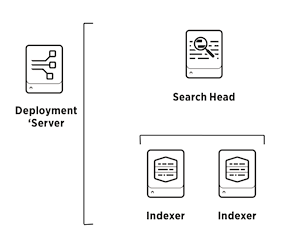

# Puppet module to create Splunk topologies

This Puppet module can be used to create and arrange Splunk instances into simple, distributed or clustered topologies. It does so with the following principles in mind:

## Principles

1. **Splunk above Puppet.** Puppet is only used to configure the running skeleton of a Splunk constellation. It tries to keep away from Splunk administration as much as possible. For example, why deploy Splunk apps to forwarders through Puppet if you can use Splunk's multi-platform deployment server?
2. **Power to the Splunkers.** A Splunk installation should typically not be administered by the IT or IT-infra teams, since it is often used in an audit context.
3. **Secure by default**.
  - Splunk runs as user splunk instead of root.
  - No services are listening by default except the bare minimum (8089/tcp)
  - TLSv1.1 and TLSv1.2 are enabled by default
  - Perfect Forward Secrecy (PFS) using Elliptic curve Diffie-Hellman (ECDH)
  - Ciphers are set to [modern compatibility](https://wiki.mozilla.org/Security/Server_Side_TLS)
  - Admin password can be set using its SHA512 hash in the Puppet manifests instead of plain-text.
4. **Supports any topology.** Single server? Redundant multi-site clustering? Heavy forwarder in a DMZ?

## Prerequisites

1. A running Puppet master
2. A running repository server with splunk and splunkforwarder packages. See below if you need help setting it up.

### Splunk YUM repository (Red Hat based)

If you don't already have a local repository server, the quickest way is to install Apache on the Puppet master and have this serve the yum repository.

1. `yum install httpd`
2. `yum install createrepo`
3. `mkdir /var/www/html/splunk`
4. `cd /var/www/html/splunk`
5. download splunk-x.y.x.rpm
6. download splunk-forwarder-x.y.x.rpm
7. `createrepo .`
8. make sure Apache allows directory index listing
9. surf to http://your.repo.server/splunk and check if you get a directory listing

Then add something like this to every node definition in site.pp, and require it from the splunk class so it it evaluated before the splunk class.

```
yumrepo { "splunk":
  baseurl => "http://your.repo.server/splunk",
  descr => "Splunk repo",
  enabled => 1,
  gpgcheck => 0
}
```

### Splunk APT repository (Debian/Ubuntu based)

If you don't already have a local repository server, the quickest way is to install Apache on the Puppet master and have this serve the APT repository.

1. `apt-get install apache2`
2. `apt-get install dpkg-dev
3. `mkdir /var/www/html/splunk`
4. `cd /var/www/html/splunk`
5. download splunk-x.y.x.deb
6. download splunk-forwarder-x.y.x.deb
7. dpkg-scanpackages . /dev/null |gzip -c > Packages.gz
8. make sure Apache allows directory index listing
9. surf to http://your.rhel-repo.server/splunk and check if you get a directory listing

Then add something like this to every node definition in site.pp, and make sure to require these files from the splunk class so they are evaluated before the splunk class. Because the APT repository above isn't signed, puppet won't be able to install splunk or splunkforwarder, except when setting `APT::Get::AllowUnauthenticated` somewhere in `/etc/apt/apt.conf.d/`. You may have to run apt-get update before the Splunk repository is available in apt-get.

```
file { "/etc/apt/apt.conf.d/99allowunsigned":
  ensure => present,
  content => "APT::Get::AllowUnauthenticated "true";\n",
}
file { "/etc/apt/sources.list.d/splunk.list":
  ensure => present,
  content => "deb http://your.apt-repo.server/splunk ./\n",
}
```

## Installation

1. SSH to your Puppet master
2. `cd /etc/puppet/modules`
3. `puppet module install jorritfolmer-splunk` or `git clone https://github.com/jorritfolmer/puppet-splunk.git; mv puppet-splunk splunk`
4. Create your Splunk topology, see below for examples.

## Usage

To give this module a try, you don't necessarily have to setup a Certiticate Authority for the various SSL certificates that Splunk uses.

1. By default Splunk already uses its own CA (1024 bits) that is used to create and sign the certificate for the 8089/tcp management port and 8000/tcp web interface: /opt/splunk/etc/auth/ca.pem. However, since everyone can grab the key from a Splunk trial download, it's an unlikely candidate for real production use.
2. Because there is already a Puppet CA in place, this module reuses the client key (4096 bits) and client certificate signed by the Puppet CA.

By default, the Splunk module doesn't manage the state of the splunk service, except configure to start Splunk or Splunkforwarder at boot time. However, if you do want Puppet to interfere while performing a cluster rolling restart or an indexer restart, have a look at the `service` parameter. 

### Example 1: 

Define a single standalone Splunk instance that you can use to index and search, for example with the trial license:


```puppet
node 'splunk-server.internal.corp.tld' {
  class { 'splunk':
    httpport     => 8000,
    kvstoreport  => 8191,
    inputport    => 9997,
  }
}
```

### Example 2: 

Extends the example above with a node that will run the Splunk universal forwarder. It uses the first server as Deployment Server (`ds =>`) where apps, inputs and outputs can be managed and deployed through Forwarder Management.


```puppet
node 'splunk-server.internal.corp.tld' {
  class { 'splunk':
    httpport     => 8000,
    kvstoreport  => 8191,
    inputport    => 9997,
  }
}

node 'some-server.internal.corp.tld' {
  class { 'splunk':
    type => 'uf',
    ds   => 'splunk-server.internal.corp.tld:8089',
  }
}
```

### Example 3: 

One deployment/license server, one search head, and two indexers:



```puppet
node 'splunk-ds.internal.corp.tld' {
  class { 'splunk':
    admin        => {
      # Set the admin password to changemeagain
      hash       => '$6$MR9IJFF7RBnVA.k1$/30EBSzy0EJKZ94SjHFIUHjQjO3/P/4tx0JmWCp/En47MJceaXsevhBLE2w/ibjHlAUkD6k0U.PmY/noe9Jok0',
      fn         => 'Deployment Server Administrator',
      email      => 'changemeagain@example.com',
    },
    # Enable the web server
    httpport     => 8000,
    # Use the best-practice to forward all local events to the indexers
    tcpout       => [
      'splunk-idx1.internal.corp.tld:9997', 
      'splunk-idx2.internal.corp.tld:9997',
    ],
  }
}

node 'splunk-sh.internal.corp.tld' {
  class { 'splunk':
    admin        => {
      # In this case, a plaintext password is also needed to join the
      # searchpeers to this search head
      pass       => 'changemeagain',
      hash       => '$6$MR9IJFF7RBnVA.k1$/30EBSzy0EJKZ94SjHFIUHjQjO3/P/4tx0JmWCp/En47MJceaXsevhBLE2w/ibjHlAUkD6k0U.PmY/noe9Jok0',
      fn         => 'Search head Administrator',
      email      => 'changemeagain@example.com',
    },
    httpport     => 8000,
    kvstoreport  => 8191,
    # Use a License Master and Deployment Server
    lm           => 'splunk-ds.internal.corp.tld:8089',
    ds           => 'splunk-ds.internal.corp.tld:8089',
    tcpout       => [ 
      'splunk-idx1.internal.corp.tld:9997', 
      'splunk-idx2.internal.corp.tld:9997', ],
    # Use these search peers
    searchpeers  => [ 
      'splunk-idx1.internal.corp.tld:8089', 
      'splunk-idx2.internal.corp.tld:8089', ],
  }
}

node 'splunk-idx1.internal.corp.tld', 'splunk-idx2.internal.corp.tld' {
  class { 'splunk':
    admin        => {
      hash       => '$6$MR9IJFF7RBnVA.k1$/30EBSzy0EJKZ94SjHFIUHjQjO3/P/4tx0JmWCp/En47MJceaXsevhBLE2w/ibjHlAUkD6k0U.PmY/noe9Jok0',
      fn         => 'Indexer Administrator',
      email      => 'changemeagain@example.com',
    },
    inputport    => 9997,
    lm           => 'splunk-ds.internal.corp.tld:8089',
    ds           => 'splunk-ds.internal.corp.tld:8089',
  }
}
```

### Example 4: 

A Splunk indexer cluster consisting of one deployment/license/searchhead server, a cluster master, and three cluster peers.


```puppet
node 'splunk-sh.internal.corp.tld' {
  class { 'splunk':
    admin        => {
      hash       => '$6$MR9IJFF7RBnVA.k1$/30EBSzy0EJKZ94SjHFIUHjQjO3/P/4tx0JmWCp/En47MJceaXsevhBLE2w/ibjHlAUkD6k0U.PmY/noe9Jok0',
      fn         => 'Search Head Administrator',
      email      => 'changemeagain@example.com',
    },
    httpport     => 8000,
    kvstoreport  => 8191,
    tcpout       => [ 'splunk-cidx1.internal.corp.tld:9997', 'splunk-cidx2.internal.corp.tld:9997', ],
    clustering   => {
      mode       => 'searchhead',
      cm         => 'splunk-cm.internal.corp.tld:8089',
    }
  }
}

node 'splunk-cm.internal.corp.tld' {
  class { 'splunk':
    admin        => {
      hash       => '$6$MR9IJFF7RBnVA.k1$/30EBSzy0EJKZ94SjHFIUHjQjO3/P/4tx0JmWCp/En47MJceaXsevhBLE2w/ibjHlAUkD6k0U.PmY/noe9Jok0',
      fn         => 'Cluster Master Administrator',
      email      => 'changemeagain@example.com',
    },
    httpport     => 8000,
    tcpout       => [ 'splunk-cidx1.internal.corp.tld:9997', 'splunk-cidx2.internal.corp.tld:9997', ],
    clustering   => {
      mode               => 'master',
      replication_factor => 2,
      search_factor      => 2,
    }
  }
}

node 'splunk-cidx1.internal.corp.tld', 
     'splunk-cidx2.internal.corp.tld',
     'splunk-cidx3.internal.corp.tld' {
  class { 'splunk':
    admin        => {
      hash       => '$6$MR9IJFF7RBnVA.k1$/30EBSzy0EJKZ94SjHFIUHjQjO3/P/4tx0JmWCp/En47MJceaXsevhBLE2w/ibjHlAUkD6k0U.PmY/noe9Jok0',
      fn         => 'Cluster Peer Administrator',
      email      => 'changemeagain@example.com',
    },
    httpport     => 8000,
    clustering   => {
      mode       => 'slave',
      cm         => 'splunk-cm.internal.corp.tld:8089',
    }
  }
}
```

## Parameters

### Main splunk class

#### `type`

  Optional. When omitted it installs the Splunk server type.
  Use `type => "uf"` if you want to have a Splunk Universal Forwarder.

#### `httpport`

  Optional. When omitted, it will not start Splunk web.
  Set `httpport => 8000` if you do want to have Splunk web available.

#### `kvstoreport`

  Optional. When omitted, it will not start Mongodb.
  Set `kvstoreport => 8191` if you do want to have KVstore available.

#### `inputport`

  Optional. When omitted, it will not start an Splunk2Splunk listener.
  Set `kvstoreport => 9997` if you do want to use this instance as an indexer.

#### `tcpout`

  Optional. When omitted, it will not forward events to a Splunk indexer.
  Set `tcpout => 'splunk-idx1.internal.corp.tld:9997'` if you do want to
  forward events to a Splunk indexer. 

#### `splunk_os_user`

  Optional. Run the Splunk instance as this user. By default
  Splunk/Splunkforwarder will run as user "splunk".

#### `splunk_home`

  Optional. Used if you're running Splunk outside of /opt/splunk or
  /opt/splunkforwarder.

#### `lm`

  Optional. Used to point to a Splunk license manager.

#### `ds`

  Optional. Used to point to a Splunk deployment server

#### `sslcompatibility`

  Optional. Used to configure the SSL compatibility level as defined by
  Mozilla Labs.  When omitted it will use "modern" compatibility. Set to
  "intermediate" or "old" if you have older Splunk forwarders or clients

#### `admin`

  Optional. Used to create a local admin user with predefined hash, full
  name and email This is a hash with 3 members:

  - `hash` (SHA512 hash of the admin password)
  - `fn`   (Full name)
  - `email` (Email address)

#### `service`

  Optional. Used to manage the running and startup state of the
  Splunk/Splunkforwarder service. This is a hash with 2 members: 

  - `ensure`
  - `enable`

#### `searchpeers`

  Optional. Used to point a Splunk search head to (a) Splunk indexer(s)

#### `clustering`

  Optional. Used to configure Splunk clustering. This is a hash with 4 members:

  - `mode` (can be one of `master`,`searchhead`,`slave`)
  - `replication_factor`
  - `search_factor`
  - `cm` (points to cluster master in case of searchhead or slave)

## Compatibility

Requires Splunk and Splunkforwarders >= 6.2.0.
However, if you still have versions < 6.2 , pass `sslcompatibility => 'intermediate'`.

If you have version >= 6.2.0 servers but with stock settings from a previous Splunk installation, also pass `sslcompatibility => 'intermediate'` in the universal forwarder declaration, otherwise the SSL connections to the deploymentserver will fail.

